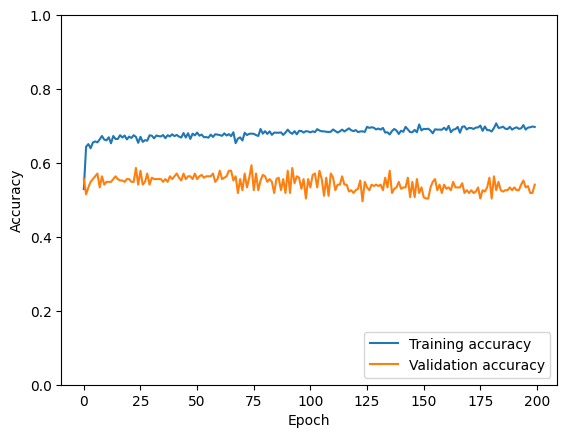
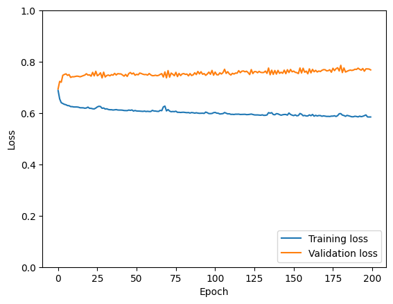
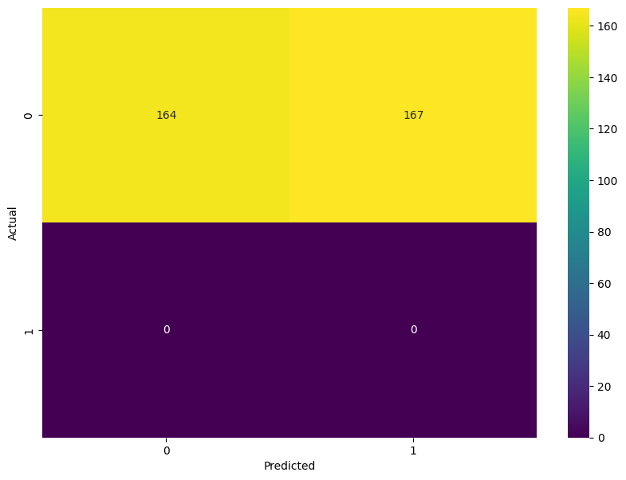

# The use of Convolutional Neural Network to classify Congenital Syphilis with image representations of tabular data
## Abstract
Although CNNs are primarily designed for image analysis, they can also be adapted to work with tabular data. This can be achieved by first converting the tabular data into images, enabling their use with image models. Several tools have been proposed in the literature to convert tabular data into images to improve classification performance. Techniques that enhance classification performance are especially valuable in complex problems such as the classification of Congenital Syphilis (CS). This work specifically aims to compare the performance of a traditional Machine Learning (ML) algorithm and simple Convolutional Neural Networks (CNNs) in classifying CS using a dataset composed of tabular data. We evaluate the performance of various methods for transforming tabular data into image representations and selected the conversion technique where the CNN achieved the highest metrics. Additionally, the CNN model was optimized using Random Search and compared to the performance of an optimized ML algorithm, Adaboost. The results indicate that CNNs can perform similarly to traditional ML algorithms when classifying images generated from CS tabular data, highlighting the potential of CNNs for improved medical data analysis.

# Summary of Results

### Training x validation accuracy and loss of the Basic-Deepinsight-CNN across epochs

### Confusion matrix

### Results of the Basic CNNs

### Results of the Tuned CNN
